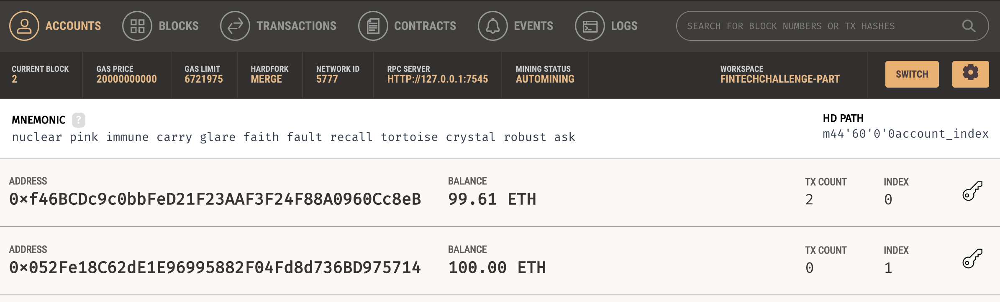

# Fintech Finder Application

Fintech Finder is an application that its customers can use to find fintech professionals from among a list of candidates, hire them, and pay them

## Features

### Generate an Ethereum Account

Using the mnemonic seed phrase provided by Ganache, create a new Ethereum account instance.

### Display Account Balance

Fetch and display the balance associated with the Ethereum account address from Ganache.

### Transaction Value Calculation

Calculate the total value of an Ethereum transaction, including the gas estimate, to pay a Fintech Finder candidate for their work.

### Sign and Send Transaction

Digitally sign a transaction that pays a Fintech Finder candidate and send this transaction to the Ganache blockchain.

### Review Transaction Hash

Review the transaction hash code associated with the validated blockchain transaction.

## How to Use

1. **Generate Account**: Used the provided mnemonic seed phrase to generate a new Ethereum account instance from Ganache.
2. **Fetch Balance**: Display the account balance for your Ethereum account on streamlit
3. **Calculate Transaction Value**: Compute the total value of a transaction, including gas.
4. **Sign and Send Transaction**: Digitally sign the transaction and send it to the Ganache blockchain.
5. **Review on Ganache**: Navigate to the Transactions section of Ganache to review the details.

### Screenshots

- 
- 
- 
- 
- 
- 
- 

## Dependencies

- **Streamlit**: For the web interface
- **web3**: For interacting with the Ethereum blockchain
- **os**: For handling environment variables
- **requests**: For making HTTP requests
- **python-dotenv**: To load environment variables from a .env file
- **bip44**: For wallet creation

## License

This project is using the following licenses:

- **Streamlit**: [Streamlit License](https://www.streamlit.io/terms)
- **Web3.py**: [Web3.py License](https://github.com/ethereum/web3.py/blob/master/LICENSE)
- **python-dotenv**: [MIT License](https://github.com/theskumar/python-dotenv/blob/master/LICENSE)

## Support

Pshum Consulting (philip.shum1@gmail.com)
